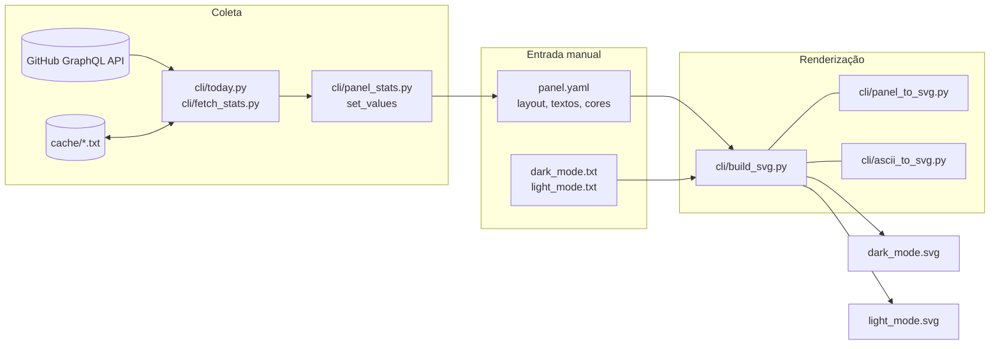

# Arquitetura

## Objetivo

Gerar, a partir de um arquivo de configuração legível (`panel.yaml`) e de duas
artes ASCII, dois SVGs de perfil — um por tema (escuro/claro) — com números do
GitHub atualizados diariamente. O `README.md` da raiz escolhe o SVG conforme o
tema do visitante:

```html
<picture>
  <source media="(prefers-color-scheme: dark)" srcset=".../main/dark_mode.svg">
  
</picture>
```

## Fluxo de dados



Em palavras:

1. **Coleta** (`today.py`, ou `fetch_stats.py` manualmente) consulta a API
   GraphQL do GitHub: idade ("Uptime"), repositórios, estrelas, seguidores,
   commits e linhas de código. Linhas de código e commits vêm de um cache
   incremental por repositório em `cache/`.
2. **Escrita** (`panel_stats.set_values`) grava esses números no `panel.yaml`
   *in place*, via regex — comentários e formatação do arquivo são preservados.
3. **Renderização** (`build_svg.py`) lê o `panel.yaml` e os `*_mode.txt` e
   recria os SVGs do zero. `panel_to_svg.py` gera o markup do painel,
   `ascii_to_svg.py` o da arte; `build_svg.py` só monta o template e grava.

A renderização não depende da coleta: `make svg` funciona offline com os
números que já estão no YAML.

## Responsabilidade de cada módulo

| Arquivo | Responsabilidade | Acessa rede? | Escreve em disco? |
|---------|------------------|:---:|:---:|
| `cli/today.py` | Queries GraphQL, cache de LOC, orquestra coleta → YAML → SVG (entrada do CI) | sim | `cache/`, `panel.yaml`, SVGs |
| `cli/fetch_stats.py` | Mesma coleta reutilizando as funções do `today.py`; tem `--no-render` | sim | `cache/`, `panel.yaml`, SVGs |
| `cli/panel_stats.py` | `get_birthday`, `set_values` (reescreve o YAML) e `render` (chama `build_svg.py` em subprocesso) | não | `panel.yaml` |
| `cli/build_svg.py` | Valida temas, calcula o canvas, monta o SVG, grava os arquivos | não | SVGs |
| `cli/panel_to_svg.py` | Markup do painel: réguas, linhas chave/valor, templates de stats, alinhamento | não | não |
| `cli/ascii_to_svg.py` | Markup da arte ASCII: um `<tspan>` por linha | não | não |

## Decisões de projeto

**SVG como saída de build, nunca editado à mão.** Cada execução apaga e recria
os dois arquivos. Consequência prática: um conflito de merge nos SVGs se
resolve rodando `make svg` — não é preciso mesclar SVG.

**YAML reescrito por regex, não por `yaml.dump`.** `set_values` altera apenas o
texto entre aspas do `value:` de cada campo. Isso mantém os comentários (que
documentam o próprio arquivo) e a ordem das chaves. O custo é um contrato de
formato: os campos atualizáveis precisam ser mapas inline de uma linha com o
valor entre aspas duplas (ver [painel.md](painel.md#campos-reescritos-automaticamente)).

**Renderização atômica.** `build_svg.py` renderiza todos os temas em memória
antes de tocar no disco. Se um tema falhar (ex.: falta uma cor), nenhum SVG é
apagado — importante porque o CI commita com `git add .` e commitaria a deleção.

**Renderização independente da coleta.** No CI, o passo `make svg` roda mesmo
se `today.py` falhar (`if: !cancelled()`), então mudanças de layout no YAML ou
na arte sempre chegam aos SVGs, com os últimos números conhecidos.

**Cache incremental de LOC.** Contar linhas adicionadas/removidas exige
percorrer o histórico de commits de cada repositório — caro. O cache guarda,
por repositório, o número de commits do branch padrão; só repositórios cujo
total mudou são reescaneados. Ver [coleta.md](coleta.md#cache-de-linhas-de-código).

**Canvas elástico.** O desenho original tem 985×530 px para um painel de 60
colunas. Se algum texto for maior, o painel e o canvas crescem sozinhos; nunca
encolhem abaixo do original. Ver [renderizacao.md](renderizacao.md#geometria-do-canvas).

**Dependências mínimas.** Apenas `requests`, `python-dateutil` e `PyYAML`
(`cache/requirements.txt`); o SVG é montado com strings, sem biblioteca de
XML.

## Pontos de entrada

| Comando | O que faz |
|---------|-----------|
| `python3 cli/today.py` | Coleta completa + YAML + SVGs, com relatório de tempos e contagem de chamadas à API |
| `python3 cli/fetch_stats.py [--no-render]` | Coleta + YAML (+ SVGs), imprime os campos gravados |
| `python3 cli/build_svg.py` | Apenas SVGs, a partir do YAML atual |
| `make setup` / `make publish` / `make svg` | Rodam os scripts acima no container Docker (serviço `app`), com o `.env` — ver [operacao.md](operacao.md) |
| `.github/workflows/build.yaml` | CI: `today.py` → `make svg` → commit + push |
