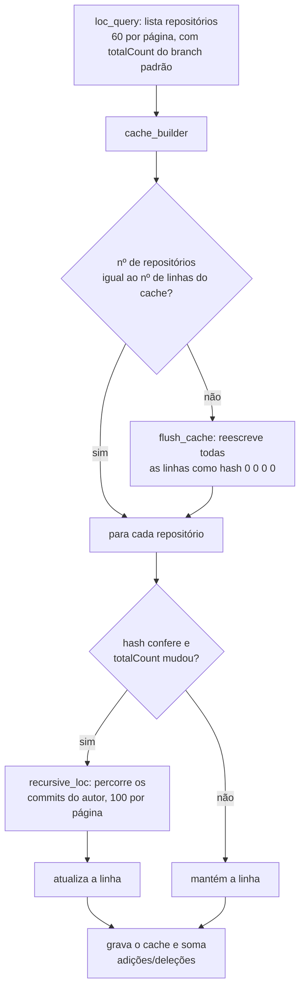

# Coleta de estatísticas do GitHub

Três arquivos:

- `cli/today.py` — funções de consulta à API GraphQL v4 e ao cache; quando
  executado diretamente, faz a coleta completa (é o que o CI roda).
- `cli/fetch_stats.py` — ponto de entrada manual que reusa as funções do
  `today.py`.
- `cli/panel_stats.py` — grava os resultados no `panel.yaml` e dispara a
  renderização.

## Credenciais e variáveis de ambiente

| Variável | Obrigatória | Padrão | Uso |
|----------|:---:|--------|-----|
| `ACCESS_TOKEN` | sim | — | Token do GitHub, enviado como `authorization: token …` |
| `USER_NAME` | sim | — | Login da conta (`rejmann`) |
| `LOC_AFFILIATIONS` | não | `OWNER,COLLABORATOR,ORGANIZATION_MEMBER` | Quais repositórios contam para LOC, commits e "Contributed" |
| `HTTP_TIMEOUT` | não | `30` | Timeout (s) de cada requisição à API |

`today.py` valida `ACCESS_TOKEN` e `USER_NAME` logo no início (`require_env()`)
e falha com uma mensagem clara. As variáveis são lidas na importação do módulo
sem exigir que existam, para que `fetch_stats.py` possa importá-lo.

### Permissões do token

*Fine-grained personal access token* com acesso a **todos os repositórios**:

- **Conta:** `Followers` (read), `Starring` (read), `Watching` (read)
- **Repositórios:** `Commit statuses`, `Contents`, `Issues`, `Metadata`,
  `Pull requests` (todos read)

Issues e pull requests não são usados hoje, mas estão previstos.

## O que é coletado

| Campo | Função | Como |
|-------|--------|------|
| `age_data` | `daily_readme(birthday)` | `relativedelta(hoje, birthday)` → `"28 years, 0 months, 21 days"`, com ` 🎂` no dia do aniversário. `birthday` vem do `panel.yaml` (`get_birthday`). |
| `repo_data` | `graph_repos_stars('repos', ['OWNER'])` | `totalCount` dos repositórios próprios |
| `contrib_data` | `graph_repos_stars('repos', LOC_AFFILIATIONS)` | `totalCount` dos repositórios nas afiliações configuradas |
| `star_data` | `graph_repos_stars('stars', ['OWNER'])` | Soma de `stargazers.totalCount` (só os 100 primeiros repositórios — sem paginação) |
| `follower_data` | `follower_getter(login)` | `followers.totalCount` |
| `loc_add` / `loc_del` / `loc_data` | `loc_query(LOC_AFFILIATIONS, 7)` | Soma de adições/deleções dos seus commits, via cache; `loc_data = add − del` |
| `commit_data` | `commit_counter(7)` | Soma da coluna "meus commits" do cache |

Antes de tudo, `user_getter(login)` obtém o ID do nó do usuário
(`{'id': 'MDQ6…'}`), guardado no global `OWNER_ID`. Ele é usado para filtrar os
commits por autor.

### Sequência em `today.py` (`__main__`)

1. `require_env()` e `chdir` para a raiz do repositório (os caminhos de
   `cache/` são relativos).
2. `user_getter` → `OWNER_ID`
3. `daily_readme(get_birthday())`
4. `loc_query(LOC_AFFILIATIONS, 7)` — atualiza o cache e retorna LOC
5. `commit_counter(7)` — lê o cache já atualizado
6. `graph_repos_stars` (estrelas, repositórios próprios, repositórios em
   afiliação) e `follower_getter`
7. Se `OWNER_ID` for o do projeto original, soma `add_archive()` (ver
   [limitações](README.md#limitações-conhecidas))
8. Formata LOC com separador de milhar
9. `set_values({...})` → `panel.yaml`
10. `render()` → SVGs
11. Imprime tempos por etapa e o total de chamadas à API por função
    (`QUERY_COUNT`)

Cada etapa é cronometrada com `perf_counter()` e impressa por `formatter()`.

`fetch_stats.py` executa a mesma sequência em `collect_stats()`, atribuindo
`today.OWNER_ID` explicitamente (é um global de módulo lido por
`recursive_loc`), e imprime os campos gravados. Com `--no-render` ele para
depois de gravar o YAML.

## Cache de linhas de código

Contar LOC exige percorrer os commits de cada repositório; o cache evita
refazer isso a cada execução.

### Arquivo

```
cache/<sha256(USER_NAME)>.txt                 # afiliações padrão (usado pelo CI)
cache/<sha256(USER_NAME)>-<afiliações>.txt    # LOC_AFFILIATIONS diferente do padrão
                                              # ex.: ...-owner.txt para LOC_AFFILIATIONS=OWNER
```

O sufixo existe para que uma execução local restrita (ex.: `OWNER`, bem mais
rápida) não sobrescreva o cache completo do CI — uma divergência no número de
repositórios zeraria o cache e forçaria um reescaneamento total.

### Formato

```
This line is a comment block. Write whatever you want here.   ┐
...                                                           │ 7 linhas de comentário
This line is a comment block. Write whatever you want here.   ┘
<sha256(owner/repo)> <commits_no_branch_padrão> <meus_commits> <adições> <deleções>
09a076d4…09b3 56262 2995 677660 263585
1624c72f…925a 8 0 0 0
```

Uma linha por repositório, na mesma ordem em que a API os retorna. O nome é
guardado como hash SHA-256 de `owner/repo`, então o arquivo não expõe nomes de
repositórios privados.

### Algoritmo



- **`loc_query`** pagina os repositórios de 60 em 60 (páginas maiores dão 502
  na API; menores geram requisições demais). Acumula os `edges` e chama
  `cache_builder` na última página.
- **`cache_builder`** cria o arquivo se não existir, invalida tudo se o número
  de repositórios mudou, e reescaneia só os repositórios cujo total de commits
  no branch padrão mudou. Repositórios vazios (sem `defaultBranchRef`) viram
  `hash 0 0 0 0`. Retorna `[adições, deleções, adições − deleções, cached]`,
  onde `cached` indica se o cache estava válido (usado só no rótulo do tempo:
  "LOC (cached)" vs "LOC (no cache)").
- **`recursive_loc`** — apesar do nome, é um laço: pagina o histórico do branch
  padrão de 100 em 100, **filtrado no servidor pelo autor** (`author: {id:
  OWNER_ID}`). Sem o filtro, um repositório compartilhado grande (ex.: 56 mil
  commits, ~3 mil seus) levaria ~20× mais páginas e estouraria o timeout do
  CI. Na primeira página imprime `owner/repo: N of my commits to scan`, para a
  execução não parecer travada.
- **`commit_counter`** soma a 3ª coluna (meus commits) de todas as linhas.

### Falhas no meio do scan

Se uma requisição de `recursive_loc` falhar, `force_close_file()` grava o que
já foi calculado antes de levantar a exceção, para não perder o progresso. Um
`403` gera a mensagem específica de limite anti-abuso do GitHub.

### Forçar reescaneamento

`loc_query(..., force_cache=True)` zera o cache. Pela linha de comando, basta
apagar o arquivo em `cache/` correspondente.

## Gravação no `panel.yaml` — `panel_stats.py`

| Função | Descrição |
|--------|-----------|
| `get_birthday(path)` | Lê `birthday:` e devolve `datetime`. Aceita data YAML nativa ou string `YYYY-MM-DD`; aborta se ausente. |
| `as_text(value)` | Inteiros com separador de milhar (`1052` → `"1,052"`); o resto via `str()`. |
| `set_values(mapping, path)` | Valida os campos contra `WRITABLE_FIELDS`, substitui cada `value:` por regex e grava o arquivo uma única vez. Campos desconhecidos → `ValueError`; campo sem alvo no YAML → aborta sem gravar. Retorna `{campo: texto gravado}`. |
| `render()` | Roda `build_svg.py` em subprocesso com o mesmo interpretador (`check=True`). |

A substituição (`_set_one`) tenta duas formas, nessa ordem:

1. `^<campo>: { … value: "…" … }` — entrada de `fields:`
2. `^- { … id: <campo> … }` — linha de `rows:`, trocando o primeiro `value: "…"`

O contrato de formato decorrente está em
[painel.md](painel.md#campos-reescritos-automaticamente).

## Chamadas à API

Todas as consultas usam `POST https://api.github.com/graphql`.
`simple_request()` levanta exceção para qualquer status diferente de 200,
incluindo a contagem de chamadas até ali. Ordem de grandeza por execução com o
cache em dia: 1 (`user_getter`) + ⌈repositórios/60⌉ (`loc_query`) + 3
(`graph_repos_stars`) + 1 (`follower_getter`), mais uma ou mais páginas de
`recursive_loc` por repositório com commits novos. Um reescaneamento completo
sem cache leva cerca de 3 minutos.
